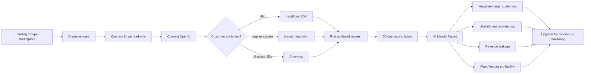
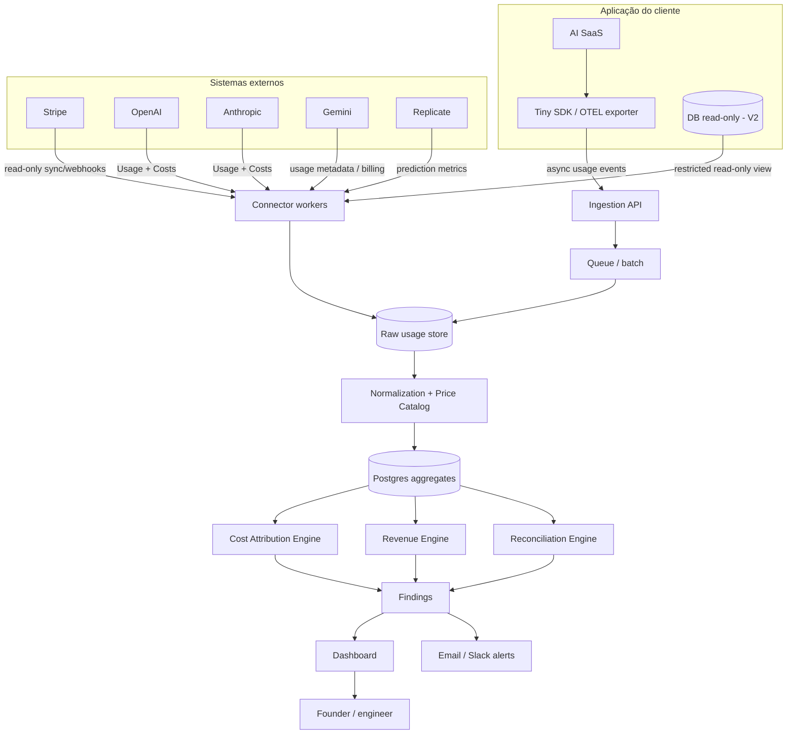
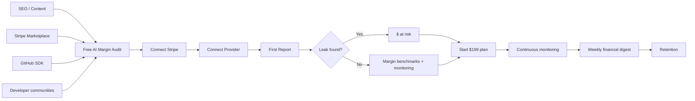
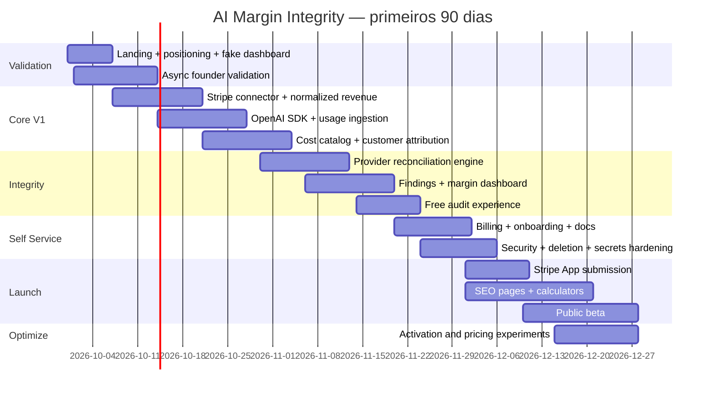

# AI Margin Integrity / Revenue Leakage Guard: oportunidade de SaaS self-service para um solo founder

## Resumo executivo

**Conclusão:** eu considero a oportunidade **boa e construível para o seu perfil**, mas faria uma mudança importante em relação à formulação inicial. Eu **não construiria simplesmente um dashboard de “margem por cliente”**. Esse espaço já começa a ter concorrência direta, inclusive um projeto open-source chamado **Margined**, cuja proposta é explicitamente juntar custos de LLM por cliente/feature com receita do Stripe para calcular margem bruta por cliente. citeturn7view0

A melhor oportunidade é um produto mais estreito e financeiramente orientado:

> **AI Margin Integrity — uma camada read-only que reconcilia o que o cliente pagou, o que sua aplicação acha que ele consumiu e o que os provedores de IA efetivamente cobraram.**

Ou, em linguagem comercial:

> **“Find the customers, usage and billing bugs that are silently killing your AI margins.”**

Essa distinção é fundamental. Langfuse e Helicone já acompanham tokens, custos e observabilidade; Stigg e Metronome cuidam de metering, credits, entitlements e monetização; DriftExact reconcilia Stripe contra acesso ao produto; Margined já explora Stripe + custos LLM. citeturn17view1turn17view0turn17view2turn18search0turn7view0

A lacuna defensável é a **reconciliação entre três livros independentes**:

```text
       MONEY LEDGER
          Stripe
             │
             ▼
     $ customer revenue
             │
             │
             ▼
┌────────────────────────────┐
│    AI MARGIN INTEGRITY     │
│                            │
│ Revenue ─ Usage ─ Provider │
│          reconciliation    │
└────────────────────────────┘
       ▲             ▲
       │             │
       │             │
 APP USAGE      PROVIDER BILL
 customer_id     OpenAI
 credits         Anthropic
 features        Gemini
 internal usage  Replicate
```

O produto não deveria perguntar apenas **“quanto custou OpenAI este mês?”**, porque os próprios provedores e observability tools já fazem isso. Ele deveria responder:

> **“Você faturou US$199 deste cliente, registrou US$61,20 de consumo no seu sistema, o provider indica US$83,47 atribuíveis, e US$22,27 não foram contabilizados pelo seu ledger. Sua margem real de IA é 58%, não 69%.”**

Essa tese é tecnicamente viável porque OpenAI disponibiliza APIs organizacionais de Usage e Costs; Anthropic possui uma Usage & Cost Admin API; Gemini retorna `usageMetadata` detalhado em cada geração; Replicate disponibiliza métricas de execução e analytics de custo. citeturn10view0turn20search27turn21search5turn21search2turn21search4

Há, porém, uma descoberta importante da pesquisa:

**Stripe + OpenAI, sozinhos, não bastam para produzir margem por cliente de maneira universal.**

A API de Usage da OpenAI pode agrupar consumo por dimensões como projeto, API key, modelo, service tier e usuário da organização, mas não possui magicamente o `customer_id` interno de cada SaaS. Portanto, para margem realmente por cliente, você precisa de uma pequena camada de atribuição — SDK, OpenTelemetry, middleware ou importação dos logs que a aplicação já mantém. citeturn10view0

Isso muda o MVP de:

> Connect Stripe + Connect OpenAI → pronto

para:

> **Connect Stripe + Connect OpenAI + tagueie cada request com um customer ID → pronto**

Ainda pode ser uma instalação de aproximadamente cinco minutos para um developer, mas é importante não vender tecnicamente algo impossível.

### Veredito resumido

| Critério | Avaliação |
|---|---:|
| Dor ligada diretamente a dinheiro | **9/10** |
| Adequação a self-service | **9/10** |
| Adequação a solo founder | **8/10** |
| Capacidade de cobrar US$100–400/mês | **8/10** |
| Complexidade técnica inicial | **7/10** |
| Concorrência atual | **6/10** |
| Canal de distribuição | **9/10** |
| Possibilidade de 30–50 clientes sustentarem o negócio | **9/10** |
| **Atratividade geral** | **~8/10 — GO, com diferenciação** |

Minha recomendação seria perseguir **“Margin Integrity / Revenue Leakage”**, não “AI observability”, “token analytics” ou “Stripe integrity” isoladamente.

O preço recomendado seria **US$99 / US$199 / US$399**, com ARPA-alvo perto de **US$199**. Uma distribuição de 30% no plano de US$99, 55% no de US$199 e 15% no de US$399 produz exatamente cerca de **US$199 de ARPA**. Nesse nível, **25 clientes ≈ US$4.975 MRR e 40 ≈ US$7.960 MRR**.

O Stripe App Marketplace é particularmente atraente para sua exigência de vendas sem call: a Stripe permite publicar Apps que qualquer usuário Stripe pode instalar e afirma que o Marketplace expõe desenvolvedores a mais de **1 milhão de empresas usando Stripe**; a própria Stripe documenta um processo de publicação e review. citeturn15search20turn15search0turn15search2

**US$5k–8k de MRR em 90 dias deve ser tratado como cenário excepcional, e não baseline.** Para um solo founder começando do zero e recusando sales calls, eu estabeleceria como sucesso dos primeiros 90 dias **5–10 clientes pagos, US$750–2.000 MRR e evidência de retenção/value discovery**. Se ARPA, conversão e churn se sustentarem, 25–40 clientes — e portanto US$5k–8k MRR — tornam-se um segundo marco plausível sem transformar o negócio numa operação de vendas.

## Produto, instalação e evolução

A melhor definição não é “FinOps para IA”. Isso imediatamente puxa o produto em direção a CloudZero, procurement, enterprise e infraestrutura extensa. CloudZero, por exemplo, já se posiciona no gerenciamento amplo de custos de cloud e IA, incluindo provedores como OpenAI e Anthropic. citeturn7view3

Também não é “LLM observability”: Langfuse já oferece tracing, custos, user tracking, alertas e métricas; Helicone oferece observabilidade, gateway, custos, user analytics e relatórios. citeturn16search11turn17view1turn17view0

O produto seria:

> **Financial integrity monitoring for AI SaaS.**

### O trabalho central do produto

Para cada cliente do SaaS:

\[
AI\ Margin =
\frac{Revenue - Direct\ AI\ Cost}{Revenue}
\]

Mas o valor maior está em responder se os componentes dessa fórmula **são confiáveis**.

O dashboard inicial ideal:

```text
AI Margin Integrity
September 2026
───────────────────────────────────────────────

Revenue tracked                  $42,719
AI provider spend                 $9,284
Attributed AI spend               $8,947
Unattributed / unexplained          $337

AI gross margin                     78.3%

Margin at risk                    $1,428
───────────────────────────────────────────────

CRITICAL

3 customers have negative AI margin
                                        -$483/mo

7 canceled customers still generated usage
                                        -$271/mo

Provider bill exceeds tracked usage
                                         $337

12 customers consumed more than
their internal credit ledger recorded
                                         $241

4 pricing plans have P90 AI margin <30%
───────────────────────────────────────────────

Top issue

Acme AI
Revenue                              $199
Tracked app cost                    $112
Provider-attributed cost            $143
AI margin                           28.1%

⚠ $31 provider cost not represented
  in your internal consumption ledger.
```

Eu evitaria chamar isso simplesmente de **gross margin**, porque infraestrutura, pagamentos, suporte e outros COGS podem estar fora do cálculo. O nome correto no produto seria **AI Gross Margin**, **AI Contribution Margin** ou **Provider Margin**, dependendo da metodologia selecionada.

### O onboarding de cinco minutos

A instalação deveria ter dois níveis.

**Zero-code scan**

```text
Create account
     ↓
Install Stripe App
     ↓
Connect OpenAI
     ↓
Import last 30 days
     ↓
Global AI Margin Report
```

Isso já consegue mostrar:

- MRR/receita no Stripe;
- custo do provider;
- relação AI spend/revenue;
- tendências;
- diferenças agregadas;
- concentração de custo por modelo/projeto.

A Stripe permite apps públicos no Marketplace e exige declaração explícita das permissões solicitadas; o review oficial também analisa requisitos do app. citeturn15search0turn15search2turn15search11

**Customer-level scan**

Mais um passo:

```javascript
margin.identify({
  customerId: user.id,
  stripeCustomerId: user.stripeCustomerId
});
```

E nas chamadas:

```javascript
margin.trackAI({
  customerId: user.id,
  feature: "deep-research",
  provider: "openai",
  model: model,
  usage: response.usage
});
```

Ou, idealmente, um wrapper que faça isso automaticamente:

```javascript
const openai = margin.wrap(new OpenAI(), {
  customerId: () => currentCustomer.id
});
```

O SDK precisa ser **assíncrono e fail-open**: se o seu serviço estiver indisponível, o SaaS do cliente continua funcionando. Langfuse emprega uma abordagem semelhante de envio assíncrono/batching para não colocar observabilidade no caminho crítico das requests. citeturn16search11

O fluxo final:



### Evolução do produto

| Versão | Escopo | Problema resolvido |
|---|---|---|
| **V1** | Stripe + OpenAI + tiny SDK | Receita, custo atribuído e AI margin por customer |
| **V1.5** | Anthropic, Gemini, Replicate; imports | Multi-provider cost integrity |
| **V2** | Stripe + read-only DB/entitlements | “Cliente cancelou mas ainda está consumindo” |
| **V3** | Credits/usage ledger | Créditos comprados vs concedidos vs consumidos vs custo real |
| **V4** | Revenue Leakage Guard | Anomalias contínuas, pricing leakage, plan/feature profitability e recomendações |

A V1 não deveria tentar construir feature flags, entitlement enforcement ou um novo billing system. A Stigg já entrega credits, entitlements, usage metering e integração Stripe; seu plano gratuito inclui 10 mil managed entities e 5 milhões de usage events por mês, e o Pro custa US$499/mês no mensal ou US$399/mês anual. citeturn17view2

Essa é uma razão forte para **não competir no enforcement**.

O seu produto observa e reconcilia.

Stigg aplica regras.

Metronome cobra.

Langfuse observa LLMs.

Você responde:

> **“Os quatro sistemas concordam financeiramente?”**

## Arquitetura, modelo de dados e motor de integridade

O princípio arquitetural mais importante é: **não virar infraestrutura crítica do cliente**.

Se o SaaS for gateway obrigatório para toda chamada OpenAI, você aumenta:

- responsabilidade por downtime;
- tráfego;
- custo;
- complexidade operacional;
- requisitos de segurança;
- receio de instalação.

O desenho adequado para solo founder é uma arquitetura **out-of-band**.



### Modelo mínimo de dados

Eu manteria o modelo relativamente simples:

| Entidade | Campos centrais |
|---|---|
| `organizations` | workspace, plan, timezone, currency |
| `connections` | Stripe/provider/type/status/secret reference |
| `customers` | internal ID, Stripe customer ID, hash/external ID |
| `subscriptions` | customer, price, status, period, recurring amount |
| `revenue_daily` | customer, date, subscription/usage revenue |
| `ai_usage_events` | request ID, customer, provider, model, tokens, feature |
| `provider_cost_daily` | provider, project/key/model/date, authoritative cost |
| `price_catalog` | provider/model/version/effective dates/pricing dimensions |
| `reconciliation_runs` | period, source totals, attributed totals, delta |
| `findings` | severity, type, customer, amount at risk, evidence |
| `credit_ledger` | V3: grants, purchases, burns, expirations, adjustments |

Não armazenaria prompt e resposta por padrão.

Você precisa de:

```text
request_id
timestamp
customer_id
feature
provider
model
input_tokens
cached_tokens
output_tokens
reasoning_tokens
provider_reported_cost (se disponível)
calculated_cost
```

e **não**:

```text
full_prompt
full_completion
customer email
customer name
conversation content
```

Isso reduz drasticamente o risco de privacidade e o tamanho dos dados.

### Providers

**OpenAI.** A API organizacional disponibiliza endpoints de Usage e Costs e permite agrupar consumo por dimensões como API key, modelo, project, service tier e usuário da organização. Isso é excelente para criar o “provider ledger”, mas não substitui o `customer_id` interno do SaaS. citeturn10view0

**Anthropic.** A Usage & Cost Admin API oferece acesso programático e granular ao uso histórico e custos da organização. Há uma limitação comercial relevante: ela é direcionada a organizações e requer credencial administrativa; portanto, o SDK continua sendo útil para startups menores ou cenários sem esse acesso. citeturn20search27

Custos não podem ser calculados simplesmente como `tokens × preço-base`: prompt caching altera preços. A Anthropic documenta, por exemplo, multiplicadores diferentes para cache write e cache hit. citeturn18search27

**Gemini.** `GenerateContentResponse.usageMetadata` expõe `promptTokenCount`, `cachedContentTokenCount`, `candidatesTokenCount`, tokens de tool use, reasoning/thought tokens e contagem total. Portanto, o SDK consegue fazer attribution por request sem tentar estimar tokenização localmente. citeturn21search5

**Replicate.** O modelo não é necessariamente baseado em tokens; predictions encerradas apresentam métricas como `predict_time` e `total_time`, e deployments têm analytics de uso/custo. Isso mostra por que sua abstração central deve ser **cost event**, não “token event”. citeturn21search2turn21search4

Ou seja:

```text
NormalizedCostEvent
 ├ customer_id
 ├ provider
 ├ resource_type
 │   ├ tokens
 │   ├ image
 │   ├ audio
 │   ├ prediction
 │   └ compute_seconds
 ├ quantity
 ├ provider_cost
 ├ calculated_cost
 └ attribution_confidence
```

Isso deixa o produto pronto para imagem, vídeo e voice posteriormente.

### Regras de detecção

O V1 deve ser **determinístico**, não “AI-powered”.

LLMs podem escrever o resumo final, mas não deveriam decidir se US$237 desapareceram da contabilidade.

**AI margin por customer**

\[
AI\ Margin_i =
\frac{Revenue_i - AI\ Cost_i}{Revenue_i}
\]

Alertas:

```text
margin < 0%        → CRITICAL
margin < 20%       → HIGH
margin < 40%       → WARNING
```

Os thresholds seriam configuráveis; esses valores são recomendações de produto, não benchmarks contábeis.

**Attribution coverage**

\[
Coverage =
\frac{Attributed\ Provider\ Cost}
{Total\ Provider\ Cost}
\]

Exemplo:

```text
OpenAI bill              $8,000
Attributed requests      $7,440

Coverage                  93.0%
Unattributed               $560
```

Você pode oferecer:

```text
>= 98%  Healthy
95–98%  Warning
< 95%   Investigate
```

O valor real será mais confiável do que um simples token dashboard justamente porque o provider ledger funciona como controle externo.

**Provider reconciliation**

\[
Delta =
Provider\ Authoritative\ Cost -
Reconstructed\ Cost
\]

Com regra:

```text
abs(delta) > max($10, 2% provider spend)
→ finding
```

A existência de custos diferenciados por cache, modalidade, modelo e tier é uma razão para manter uma tabela de preços versionada. Gemini, por exemplo, expõe tokens de cache e de reasoning separadamente, e Anthropic documenta preços distintos para caching. citeturn21search5turn18search27

**Unprofitable customer**

```sql
ai_cost > revenue
```

Finding:

> “Customer C-294 generated US$71.40 of provider costs against US$49.00 of subscription revenue.”

**Cost spike**

Para um solo founder, não há necessidade de ML complexo inicialmente. Use robust statistics:

\[
z_{robust} =
\frac{x - median(x)}
{1.4826\times MAD(x)}
\]

Aplicado a:

```text
cost / customer / day
tokens / customer / day
cost / feature / day
cost / revenue
```

Isso é barato, explicável e resistente a outliers.

**Canceled-but-consuming — V2**

```text
Stripe subscription:
canceled / unpaid / ended

AND

usage after entitlement end > threshold
```

Essa é exatamente a classe de divergência que produtos como DriftExact monitoram entre Stripe e acesso interno; DriftExact explicitamente trabalha de forma read-only e determinística, sem alterar billing ou entitlements automaticamente. citeturn18search20

No seu caso:

```text
Subscription canceled Aug 17
AI usage after Aug 17: $87.12
Current month projection: $132

LIKELY REVENUE LEAK
```

**Credit leakage — V3**

O ledger deveria obedecer:

\[
Opening + Purchased + Granted - Consumed - Expired \approx Closing
\]

e comparar:

```text
Internal consumed credits
            versus
actual provider-cost-equivalent consumption
```

Stigg hoje enfatiza justamente wallets, ledgers, credits, burn-down e integridade de grants/deductions, mostrando que esse problema de accounting de créditos é suficientemente relevante para já sustentar infraestrutura especializada. citeturn16search0turn17view2

A sua diferenciação é **auditar**, e não substituir esse ledger.

## Concorrência, posicionamento e tamanho real da lacuna

A pesquisa alterou materialmente minha percepção inicial: **a oportunidade é validada, mas deixou de ser “blue ocean”.**

Há vários competidores adjacentes e pelo menos um concorrente quase conceitualmente idêntico.

| Produto | Foco | Preço público atual | Onde bate no produto | Lacuna aproveitável |
|---|---|---:|---|---|
| **Margined** | Stripe + LLM cost → margin/customer | Open-source/MIT | **Muito alto** | Ainda é mais “unit economics layer” que integrity/reconciliation engine. citeturn7view0 |
| **DriftExact** | Stripe ↔ product access | £399 / £900+ mês | Alto em V2 | Não é AI cost/unit economics; possui motion de request access. citeturn18search0turn18search20 |
| **Bleedpoint** | Stripe revenue leakage audit | Scan gratuito; relatório pago ~US$99 | Médio | Stripe-only; não resolve AI COGS/attribution. citeturn3search3 |
| **Stigg** | Credits, metering, entitlements, monetization | Free / US$499 mensal; US$399 anual | Alto em V3 | Enforcement infra, não reconciliation-first. citeturn17view2 |
| **Langfuse** | LLM observability, tracing, tokens/costs | Free / US$29 / US$199 | Alto em usage data | Sem Stripe revenue integrity como JTBD central. citeturn17view1 |
| **Helicone** | Observability + gateway + costs | Free / US$79 / US$799 | Alto em usage/cost | Mais AI engineering/gateway que financial reconciliation. citeturn17view0 |
| **Metronome** | Usage metering + billing | Startup: US$0,04/1k events + 0,8% billing volume | Médio/alto | Infra de monetização mais ampla; seu produto seria auditor. citeturn22search6 |
| **CloudZero** | Cloud/AI FinOps | Enterprise/request pricing | Médio | Muito mais amplo e enterprise-oriented. citeturn7view3 |

O competidor mais importante estrategicamente é **Margined**.

O README do projeto descreve uma “unit economics layer for AI SaaS”, juntando custos LLM tagueados por customer/feature com receita Stripe, mostrando gross margin por customer, custo por feature e pricing calculator. Ele já possui SDK, Stripe OAuth/webhooks e suporte de pricing a diversos providers. citeturn7view0

Portanto:

> **“Stripe + AI cost = margin per customer” sozinho não é moat nem produto suficientemente diferenciado.**

Eu mudaria a homepage de:

> ❌ “Know your AI margin per customer.”

para:

> **“Reconcile every dollar you charge with every dollar your AI providers charge.”**

E a subheadline:

> **“Find negative-margin customers, unattributed AI spend, broken credit counters and billing leaks before they eat your MRR.”**

Essa mudança posiciona o produto numa interseção diferente:

```text
                 Observability
                      │
        Langfuse      │      Helicone
                      │
                      │
──────────────────────┼─────────────────────
                      │
                      │ AI Margin Integrity
                      │        ●
                      │
     DriftExact       │           Stigg
──────────────────────┼─────────────────────
 Stripe Integrity     │       Monetization
```

O moat inicial não virá de tecnologia impossível de copiar.

Ele pode vir de quatro coisas combinadas:

**Reconciliation semantics.** Um catálogo confiável e versionado de como cada provider conta caching, reasoning, images, compute e tiers.

**Historical findings.** Entender quais divergências são bug, arredondamento, delay, refund, late event, provider adjustment ou leakage real.

**Integrations.** Stripe + providers + customer ID + DB + credit systems.

**Trust.** “Read-only financial integrity layer” é um posicionamento mais forte que “mais um dashboard de tokens”.

A pressão competitiva tende a aumentar. Stripe Billing já suporta subscription e usage-based billing, e cobra atualmente 0,7% do Billing volume em pay-as-you-go; a Stripe também incorporou Metronome ao seu stack de monetização. citeturn8search14turn21search1turn22search6

Isso é mais um motivo para **não competir em cobrança**.

Faça o equivalente a um auditor independente.

## Pricing, matemática para US$5k–8k e unit economics

Eu evitaria completamente planos de US$19–39.

Seu objetivo exige ARPA alto o suficiente para não criar um trabalho de suporte incompatível com solo founder.

### Pricing recomendado

| Plano | Preço | Limite sugerido | Funcionalidade |
|---|---:|---|---|
| **Free Audit** | US$0 | 30 dias, scan pontual | Mostra top 3 findings e global AI margin |
| **Starter** | **US$99/mês** | até ~US$5k/mês AI spend | Stripe + 1 provider, daily reconciliation |
| **Growth** | **US$199/mês** | até ~US$25k AI spend | multi-provider, feature/customer margin, alerts |
| **Scale** | **US$399/mês** | até ~US$100k AI spend | DB/credits reconciliation, hourly sync, long retention |

**Sem “Contact Sales”.**

Ao ultrapassar limite:

```text
You exceeded your tracked spend allowance.

Current: $28,412
Growth limit: $25,000

[ Upgrade to Scale — $399/mo ]
```

Isso preserva totalmente sua regra de self-service.

Eu cobraria principalmente por **tracked provider spend**, não por seats.

É intuitivamente alinhado ao valor:

```text
AI spend ↑
financial risk ↑
value of monitoring ↑
data volume ↑
price ↑
```

Stigg também já abandonou seat-based pricing no seu produto atual e cobra com base nos objetos/events que sua infraestrutura gerencia, mostrando que pricing não baseado em seats é natural nesse mercado. citeturn17view2

### Clientes necessários

| ARPA | Clientes para ~US$5k | Clientes para ~US$8k |
|---:|---:|---:|
| US$99 | 51 | 81 |
| US$149 | 34 | 54 |
| **US$199** | **26** | **41** |
| US$249 | 21 | 33 |
| US$299 | 17 | 27 |
| US$399 | 13 | 21 |

Um mix de:

```text
30% Starter × $99
55% Growth  × $199
15% Scale   × $399
```

produz:

\[
ARPA \approx \$199
\]

Portanto:

| Clientes | MRR estimado |
|---:|---:|
| 10 | US$1.990 |
| 15 | US$2.985 |
| 20 | US$3.980 |
| **25** | **US$4.975** |
| **30** | **US$5.970** |
| **35** | **US$6.965** |
| **40** | **US$7.960** |

Isso é muito mais compatível com solo founder que 200 clientes de US$29.

### Disposição a pagar

Há bons anchors competitivos.

DriftExact começa em **£399/mês** para integridade on-demand e **£900/mês** para continuous monitoring. citeturn18search0

Stigg cobra **US$499/mês** no Pro mensal. citeturn17view2

Langfuse cobra **US$199/mês** pelo Pro de observabilidade. citeturn17view1

Helicone vai de **US$79 Pro para US$799 Team**. citeturn17view0

Logo, US$199 para um produto que efetivamente responde **“quanto dinheiro estou perdendo?”** não parece fora da faixa observada no mercado. Isso é inferência de posicionamento, não prova de que clientes comprarão; a validação precisa vir da conversão real. citeturn18search0turn17view2turn17view1turn17view0

### Custos operacionais

Eu usaria uma stack simples:

```text
Frontend/API     → Cloudflare / Vercel
Postgres         → Neon / Supabase
Queue            → Cloudflare Queues / managed queue
Raw archives     → object storage
Analytics        → Postgres rollups inicialmente
Monitoring       → Sentry/OpenTelemetry
Emails           → Resend/Postmark equivalente
```

Cloudflare Workers, por exemplo, publica atualmente preço de **US$0,30 por milhão de requests**, além de cobrança de CPU, o que mostra que requests HTTP em si não precisam ser o principal COGS; armazenamento e processamento de telemetria provavelmente serão os drivers mais importantes à medida que o volume cresce. citeturn13search15

Neon oferece Postgres serverless com pricing baseado em uso, sendo uma opção coerente para workload inicial variável. citeturn13search2

Eu **não usaria LLM para o core do produto**.

Reconciliation:

```text
SQL
rules
aggregations
robust statistics
```

LLM opcional:

```text
"Explain these 7 findings to the founder"
```

Assim, o custo de modelo do seu próprio SaaS fica praticamente irrelevante perto da receita.

### Sensibilidade de infraestrutura

Os valores abaixo são **premissas de modelagem**, não preços cotados de fornecedores.

| Cenário | MRR | Usage events/mês | Infra estimada | Pagamentos* | Outros COGS | Margem bruta modelada |
|---|---:|---:|---:|---:|---:|---:|
| Lean | US$5.000 | 1M | US$120 | ~US$335 | US$20 | **~90,5%** |
| Normal | US$6.500 | 10M | US$350 | ~US$436 | US$30 | **~87,4%** |
| Heavy | US$8.000 | 50M | US$1.200 | ~US$536 | US$50 | **~77,7%** |

\*O cenário de pagamentos usa aproximadamente 6,7% como referência conservadora de um founder cobrando cartões internacionais pela Stripe Brasil e usando Stripe Billing: atualmente a Stripe Brasil publica 3,99% + R$0,39 para cartão nacional, acréscimo de 2% para cartões internacionais e 0,7% do Billing volume para Stripe Billing. A composição real depende da entidade, moeda, método de pagamento, conversão e produto Stripe utilizados. citeturn22search6turn21search1

Isso revela algo importante:

> **O risco para a margem do seu SaaS não é quantidade de clientes; é quantidade de raw telemetry.**

50 empresas pequenas gerando 2 milhões de events podem ser baratas.

10 empresas enormes gerando 100 milhões podem ser caras.

Portanto, retenção e rollups são fundamentais:

```text
Raw events        30–90 dias
Hourly aggregate  12 meses
Daily aggregate   indefinido
```

E o SDK deve fazer batching.

No começo, eu ficaria só em Postgres. ClickHouse ou outra infra analítica só entraria quando a telemetria comprovadamente justificar. Langfuse, que opera numa escala de observabilidade muito superior ao MVP aqui proposto, utiliza ClickHouse em sua arquitetura atual; isso mostra uma possível rota futura, não uma necessidade de V1. citeturn16search5

### LTV e churn

Com:

```text
ARPA = $199
Gross margin = 90%
```

uma aproximação simples de LTV é:

\[
LTV \approx
\frac{ARPA \times Gross\ Margin}
{Monthly\ Churn}
\]

| Churn mensal | LTV aproximado |
|---:|---:|
| 2% | ~US$8.955 |
| 3% | ~US$5.970 |
| 5% | ~US$3.582 |
| 8% | ~US$2.239 |

Isso ilustra por que churn é muito mais importante do que economizar US$30 de hosting.

Se o produto vira:

> “Olhei uma vez, corrigi os problemas e cancelei”

você tem um **audit product**, não um SaaS.

Portanto, V1 precisa desde cedo justificar continuidade através de:

```text
new leak detection
continuous margin monitoring
model-price changes
new customers
plan margin drift
provider reconciliation
daily/weekly alerts
```

## Aquisição sem calls, segurança e métricas de validação

A distribuição é um dos pontos mais fortes da ideia para o seu perfil.

### Stripe Marketplace como canal principal

A Stripe permite publicar apps globais no Stripe App Marketplace e afirma que eles podem alcançar mais de **1 milhão de empresas** que utilizam a plataforma. Usuários podem instalar o app diretamente; o processo oficial de publicação inclui manifest, permissions, listing e App Review. A documentação atual também informa que listings públicos são em inglês. citeturn15search20turn15search2

Isso encaixa quase perfeitamente no motion desejado:

```text
Stripe Marketplace
       ↓
Install
       ↓
Authorize read-only
       ↓
Free Margin Audit
       ↓
"You have $1,287 of margin at risk"
       ↓
$199/mo continuous monitoring
       ↓
Credit card
       ↓
Done
```

Sem:

```text
Book a demo
Discovery call
Custom quote
Proposal
Procurement call
Onboarding call
CSM
```

O Marketplace, porém, deve ser tratado como **canal**, não como estratégia inteira.

### Funil recomendado



O lead magnet deve ser **o produto**, não um ebook:

> **Free AI Margin Audit**

Headline:

> “Connect Stripe and your AI provider. See which customers are profitable.”

Depois:

> “We found US$784/month of unexplained AI cost.”

CTA:

> **Monitor continuously — US$199/mo**

Isso reduz drasticamente a necessidade de vender por conversa.

### SEO e conteúdo

As páginas programáticas mais interessantes seriam ligadas a intenção financeira/técnica:

```text
/openai-cost-per-customer
/anthropic-cost-per-customer
/ai-saas-gross-margin
/openai-stripe-integration
/llm-unit-economics
/ai-saas-pricing-calculator
/stripe-revenue-leakage
/ai-credit-system-reconciliation
/openai-token-cost-calculator
/anthropic-token-cost-calculator
```

Há um benefício adicional: pricing de modelos fica cada vez mais multidimensional — caching, reasoning, modalidades e tiers — então ferramentas de cálculo podem funcionar como topo de funil. A documentação do Gemini expõe várias categorias de tokens distintas, enquanto Anthropic diferencia caching na precificação. citeturn21search5turn18search27

### Developer-led distribution

Eu open-sourceria somente o SDK:

```text
@margin-integrity/node
margin-integrity-python
```

Não o reconciliation engine.

O SDK pode se tornar um canal:

```text
npm install margin-integrity
```

README:

> “Know the real AI cost and margin of every customer.”

Isso é particularmente importante porque Margined já é MIT/open-source e oferece instrumentação própria; você não deveria competir tentando esconder um wrapper trivial como segredo comercial. citeturn7view0

### ICP inicial

Eu começaria somente com:

> **Founder-led AI SaaS usando Stripe, com US$5k–200k MRR, custos variáveis relevantes de OpenAI/Anthropic/etc. e sem equipe própria de FinOps.**

Evitaria inicialmente:

```text
Enterprise
banks
healthcare
huge self-hosted deployments
custom Salesforce implementations
annual procurement
SLA negotiations
on-prem
```

Porque isso mata precisamente a característica que torna a ideia atraente para você.

### Read-only como estratégia comercial

DriftExact explicitamente enfatiza:

> leitura do Stripe + leitura da base de access + comparação determinística + nenhuma alteração automática.

Isso é um excelente princípio para copiar arquiteturalmente. citeturn18search20turn18search16

O seu produto deveria ter um badge visível:

```text
✓ Read-only Stripe access
✓ Never cancels subscriptions
✓ Never changes prices
✓ Never modifies entitlements
✓ Never blocks an AI request
✓ No prompts stored by default
```

Só isso reduz muito a pergunta:

> “E se esse software quebrar meu billing?”

Resposta:

> **Ele não tem permissão para quebrar seu billing.**

### Permissões

Stripe:

```text
customers: read
subscriptions: read
prices: read
products: read
invoices: read
invoice items: read
charges/payment state as necessary: read
```

Nada de:

```text
refund
cancel
update price
create invoice
modify customer
```

Stripe Apps exige que permissões sejam declaradas e justificadas no manifest, o que combina bem com o posicionamento minimalista. citeturn15search2

Para V2, banco:

```sql
CREATE USER margin_integrity_reader ...;

GRANT SELECT ON billing_integrity_view
TO margin_integrity_reader;
```

Melhor ainda: pedir ao cliente uma view:

```sql
CREATE VIEW billing_integrity_view AS
SELECT
    internal_customer_id,
    stripe_customer_id,
    plan,
    entitlement_status,
    credits_balance
FROM ...
```

Assim você nem precisa visualizar o resto do banco.

### Dados e privacidade

A arquitetura deveria seguir minimização forte.

A LGPD exige, entre outros princípios, finalidade, necessidade, transparência, segurança, prevenção e responsabilização; o texto legal também determina medidas técnicas e administrativas para proteger dados pessoais contra acesso não autorizado e eventos ilícitos ou acidentais. citeturn20search2turn20search13

Por isso:

```text
customer_id = SHA256(workspace_secret + internal_customer_id)
```

em vez de:

```text
henrique@email.com
Henrique Silva
CPF
address
```

Outras medidas essenciais:

- secrets criptografados com KMS/secret manager;
- credenciais separadas por tenant;
- rotação/revogação simples;
- logs sem secrets;
- data deletion self-service;
- export de dados;
- configurable retention;
- subprocessors page;
- Privacy Policy;
- DPA;
- audit trail de connections;
- região EU posteriormente, se demanda justificar.

Para Stripe, usar Checkout/hosted payment collection também evita que dados sensíveis de cartão trafeguem pelo seu backend; a Stripe destaca essa arquitetura dentro de suas ferramentas PCI-compliant. citeturn22search6

Eu **não faria SOC 2 no MVP**.

Stigg e Langfuse mostram que SOC 2/ISO e recursos enterprise tendem a aparecer em estágios/tier mais avançados de produtos dessa categoria. citeturn17view2turn17view1

Primeiro:

```text
Security page
DPA
subprocessors
encryption
least privilege
no content storage
read-only
incident policy
```

### Métricas de go/no-go

Para não passar seis meses apaixonado pela tecnologia, eu estabeleceria thresholds.

| Métrica | Meta de validação |
|---|---:|
| Connect Stripe → first report | **<5 min p50** |
| Full customer attribution setup | **<15 min p50** |
| Users que completam onboarding | **>50%** |
| Provider spend atribuído | **>95%** |
| Scans que encontram finding monetário real | **>30%** |
| Free audit → paid | **>10%** |
| ARPA após primeiros 10 clientes | **>US$150** |
| CAC orgânico/blended inicial | **<US$300** |
| CAC payback | **<2 meses** |
| Monthly logo churn após estabilizar | **<3%** |
| Gross margin do seu SaaS | **>85%** |
| Support demand | **<30 min/cliente/mês** |

A métrica mais valiosa não deve ser “tokens monitored”.

Deve ser:

> **Margin recovered / leakage detected**

Exemplo:

```text
Lifetime Margin Protected

$18,472

Leakage detected:       $11,284
Negative margin fixed:   $4,912
Unattributed cost fixed: $2,276
```

Isso cria uma defesa enorme contra churn.

Cliente pensando em cancelar:

```text
Your subscription: $199/mo
Margin protected in last 90 days: $4,318
```

A discussão muda.

## Riscos estratégicos e roadmap de noventa dias

Os riscos são reais e devem determinar o escopo.

### Risco de a Stripe absorver o problema

Stripe já está aumentando sua presença em subscriptions, usage-based billing, entitlement-style functionality e metering; Billing cobra 0,7% do volume no modelo pay-as-you-go, e Metronome oferece metering/pricing/billing especializado dentro do portfólio atual. citeturn21search1turn22search6

**Mitigação:** nunca tentar ser billing infrastructure.

Seu produto deve conseguir auditar:

```text
Stripe
Metronome
Stigg
internal ledger
providers
```

O auditor continua útil mesmo quando o billing melhora.

### Risco de Langfuse/Helicone adicionar Stripe revenue

É tecnicamente simples para um observability player adicionar uma coluna de Stripe revenue. Langfuse já acompanha users, tokens e costs; Helicone já possui user analytics, costs e reports. citeturn17view1turn17view0

**Mitigação:** focar em reconciliation correctness, revenue leakage, provider-authoritative totals, credit ledger mismatch e financial findings, não dashboards.

### Risco Margined

Esse é o risco mais direto: Margined já descreve praticamente a V1 conceitual. citeturn7view0

**Mitigação:** pular rapidamente do simples `revenue - LLM cost` para:

```text
provider reconciliation
attribution coverage
revenue leakage
credits mismatch
subscription-state integrity
historical evidence
explainable findings
```

O slogan interno deve ser:

> **Margined tells you the margin. We tell you whether you can trust the margin.**

### Risco de instalação maior que cinco minutos

Esse é talvez o maior risco de produto.

Não existe margem por customer sem algum vínculo entre AI request e customer.

**Mitigação: quatro caminhos:**

```text
1. Tiny SDK
2. OpenTelemetry
3. Existing Langfuse/Helicone import
4. Read-only DB mapping
```

Nunca force o cliente a refatorar toda a aplicação.

### Risco de custo de telemetria

O custo explode por request volume.

**Mitigação:**

```text
batching
sampling somente para não-financial metadata
raw retention limits
daily rollups
object-storage archival
event-volume caps
usage-based overages
```

Nunca sampleie campos necessários para cálculo financeiro; faça sampling somente do que não altera totals.

### Risco de falso positivo financeiro

Um alerta dizendo:

> “Você perdeu US$3.000”

quando não perdeu destrói a confiança.

**Mitigação:** findings precisam possuir evidência:

```text
Finding: $337.21 unexplained provider cost

Provider total       $8,284.11
Attributed total     $7,946.90
Difference             $337.21

Period: Sep 1–Sep 28
Provider: OpenAI
Projects affected: 2
Confidence: High

[See reconciliation]
```

Nada de caixa-preta com “AI detected anomaly”.

### Plano de noventa dias



**Dias 1–14:** antes de construir tudo, landing funcional, screenshots e um “margin calculator”. Validação totalmente assíncrona: founder communities, emails, DMs e formulário. Nenhuma call é necessária.

A pergunta não deve ser:

> “Você compraria isso?”

Deve ser:

> “What percentage of your AI spend can you currently attribute to individual paying customers?”

e:

> “How do you know your internal usage counters match what your providers charge?”

Meta: obter pelo menos 15–30 respostas qualificadas e 5 pessoas dispostas a conectar dados de sandbox/sample.

**Dias 15–30:** construir somente:

```text
Stripe connection
OpenAI SDK
customer mapping
price catalog
AI cost/customer
revenue/customer
AI margin/customer
```

Nada de Anthropic.

Nada de Slack.

Nada de DB connector.

Nada de AI assistant.

Nada de fancy forecasting.

**Dias 31–45:** construir o verdadeiro diferencial:

```text
provider total
attributed total
reconciliation delta
unattributed cost
negative margin
cost spikes
plan margin distribution
```

A OpenAI Usage/Cost API torna possível ter esse controle externo à instrumentação do SDK. citeturn10view0

**Dias 46–60:** transformar software em produto:

```text
one-click onboarding
billing
email alerts
error recovery
docs
API key rotation
data deletion
security page
free audit
```

**Dias 61–75:** Stripe App + distribuição. Stripe documenta Marketplace público, permissions e review; atualmente seu guia indica um processo formal de submissão e revisão. citeturn15search2

Publicar simultaneamente:

```text
OpenAI Cost per Customer Calculator
AI SaaS Margin Calculator
Stripe + OpenAI Margin Guide
LLM Unit Economics Guide
```

**Dias 76–90:** parar de adicionar providers e otimizar:

```text
visit → signup
signup → Stripe connected
Stripe connected → provider connected
provider → attribution
attribution → first finding
finding → paid
paid → week-4 retained
```

Somente depois eu faria Anthropic.

### Critério ao final dos noventa dias

**GO forte**

```text
>= 10 paid
>= $1.5k MRR
ARPA >= $150
audit→paid >= 10%
meaningful finding em >=30% dos scans
attribution >=95%
no customer calls required
```

**GO, mas iterar**

```text
5–9 paid
$500–$1.5k MRR
usuários amam finding mas onboarding é ruim
```

**Pivot**

```text
muitas instalações
poucos findings
pouca willingness to pay
```

**Kill**

```text
founders conseguem resolver tudo facilmente
com Stripe + Langfuse SQL

ou

ninguém confia o suficiente para conectar
provider/billing data
```

O ponto é que **o primeiro milestone não é US$8k MRR**.

É provar:

> **“Quando conectamos os três livros, encontramos dinheiro que o founder não sabia que estava perdendo — e ele paga continuamente para nunca mais ficar cego.”**

Caso isso aconteça, a matemática subsequente é bastante favorável: com ARPA perto de **US$199**, você não precisa de centenas de empresas; precisa de aproximadamente **26–41 clientes para US$5k–8k MRR**.

E há um encaixe excepcionalmente bom com a sua restrição de solo founder: o Stripe Marketplace suporta distribuição instalável diretamente por usuários e alcança um ecossistema de mais de um milhão de empresas Stripe, enquanto os maiores concorrentes de monetização e integrity rapidamente sobem para US$399, US$499, £399 ou mais — deixando espaço para uma ferramenta especializada de US$99–399, totalmente self-service. citeturn15search20turn17view2turn18search0

**Minha tese final é, portanto: não construa “AI Margin Analytics”. Construa “AI Margin Integrity”.** A primeira mostra números; a segunda encontra divergências financeiras. Analytics já está congestionado. **“Você está perdendo US$842/mês aqui, e estes são os sete eventos que provam isso”** é uma proposta muito mais forte, monetizável e adequada ao caminho de 25–40 clientes que você está procurando.